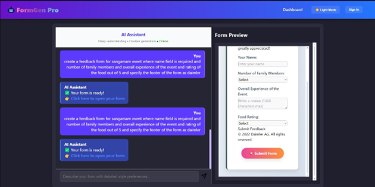

#  Form Generation Using LLM – Dynamic Form Generator

##  Project Overview

**Form Generation Using LLM** is a dynamic and intelligent form generation system developed using *Python* and *Flask*. The project enables real-time web-based form creation, rendering, and data tracking. Designed with modularity and extensibility in mind, it helps automate data entry, form-based workflows, and front-end/backend integrations using minimal configuration.

It leverages JSON-based templates and memory models to handle form history, form states, and dynamic user interactions efficiently. Suitable for admin panels, feedback systems, survey engines, and internal tooling dashboards.


##  Key Features

*  Dynamic form generation using JSON-based templates
*  Persistent memory tracking of user inputs and states
*  Logs and histories stored as structured JSON (`form_log`, `chat_history`)
*  Modular folder structure for `form_templates`, `static`, and `templates`
*  Flask-powered backend (`appy.py`) with route handling and rendering
*  No external database needed – all data handled via files

---

##  Technologies Used

* *Python 3.10+*
* *Flask* – Web framework for routing/rendering
* *HTML + Jinja2* – Template rendering engine
* *JavaScript* – For interactivity and validation
* *JSON* – For state, form definition, and memory management
* *CSS (inside /static)* – For styling the frontend


##  How It Works

### 1. Template-Driven Form Creation

* JSON templates stored inside `form_templates/` define form fields, labels, and logic.
* These are rendered using Flask and Jinja2 into browser-friendly HTML forms.

### 2. Data Logging and Memory

* User interactions and generated forms are logged in:

  * `chat_history.json` – tracks interactions
  * `form_log.json` & `form_logs.json` – record form structure and submissions
  * `memory.json` – handles transient data during a session

### 3. Flask Backend (appy.py)

* Acts as the brain of the system, handling:

  * Route-based rendering
  * Loading form templates
  * Saving form responses
  * Managing session data


##  Setup Instructions

1. **Clone the Repository**

   ```bash
   git clone https://github.com/vignesh33-ui/Form-Generation-Using-LLM.git
   cd Form-Generation-Using-LLM
   ```

2. **Install Dependencies**

   ```bash
   pip install Flask
   ```

3. **Run the Flask App**

   ```bash
   python appy.py
   ```

4. **Open in Browser**

   Navigate to `http://127.0.0.1:5000` to access the form generator UI.


##  Folder Structure

```
form-gen-pro/
│
├── appy.py               # Flask backend
├── LICENSE               # License file
├── .gitattributes        # Git config for line endings
│
├── form_templates/       # JSON form definitions
├── templates/            # Jinja2 HTML templates
├── static/               # CSS/JS assets
│
├── chat_history.json     # Logged user chat form interactions
├── form_log.json         # Recent form log
├── form_logs.json        # Complete form submission logs
├── memory.json           # Session memory tracking
└── README.md             # Project documentation
```


##  Demo 




##  Author

**Vignesh M N**
 [LinkedIn](https://https://www.linkedin.com/in/vignesh-m-n-3b5282270?)
 [GitHub](https://github.com/vignesh33-ui)


